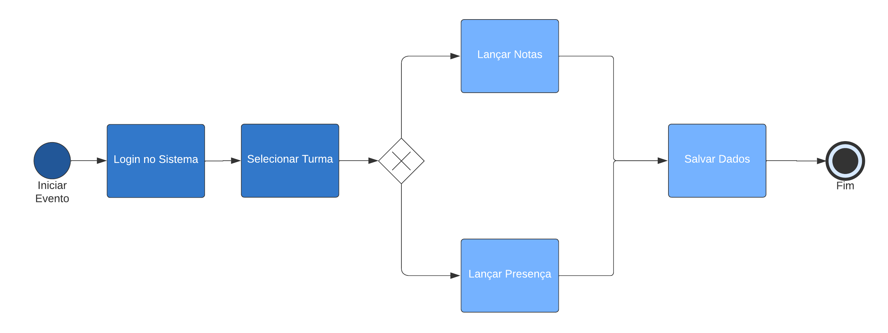
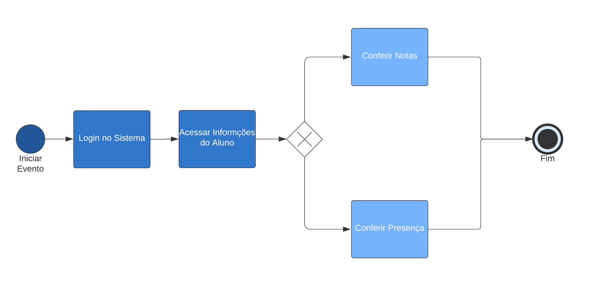
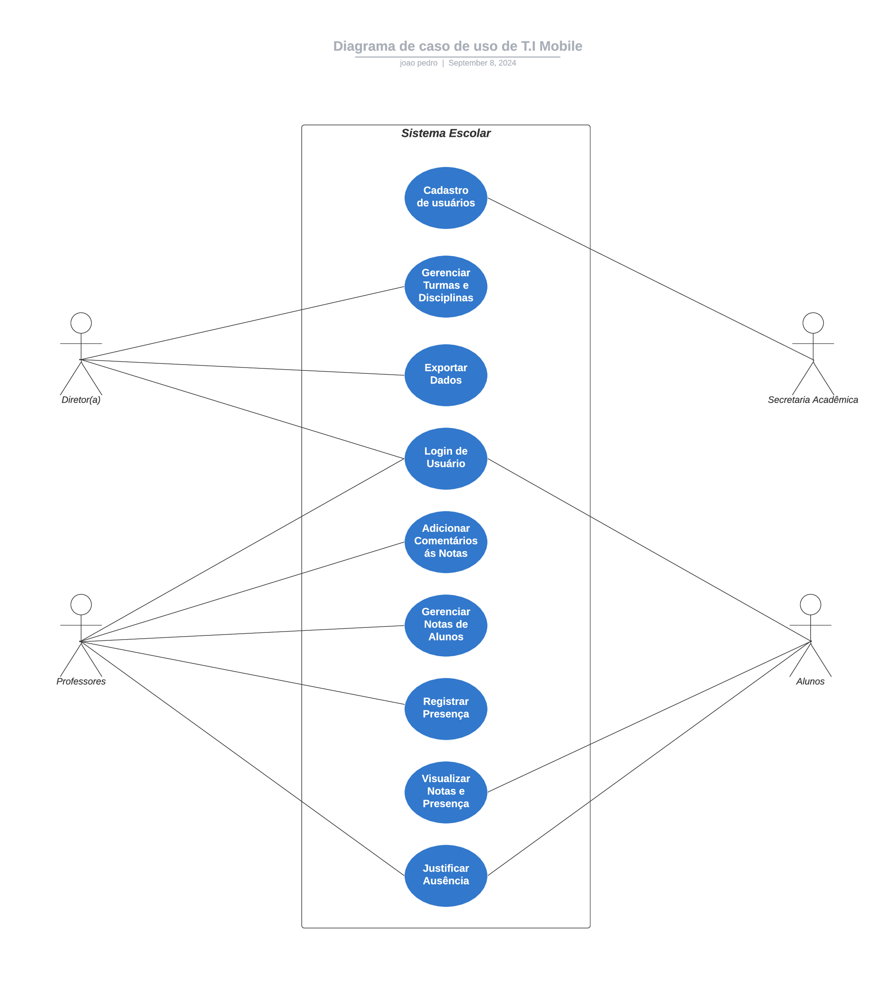
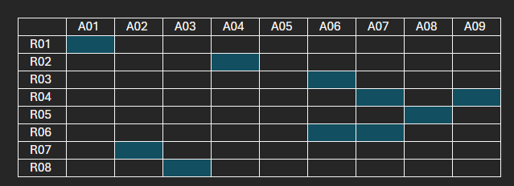
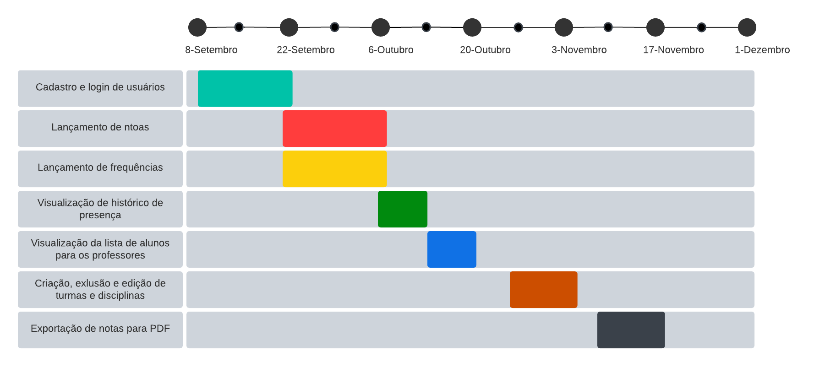
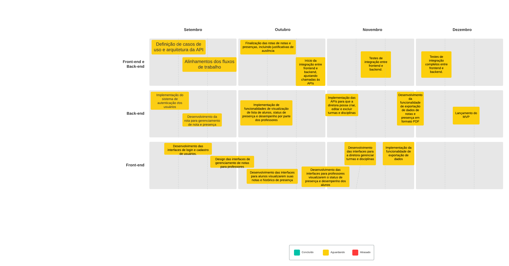

# Especificações do Projeto

Pré-requisitos: <a href="1-Documentação de Contexto.md"> Documentação de Contexto</a>

Definição do problema e ideia de solução a partir da perspectiva do usuário. É composta pela definição do  diagrama de personas, histórias de usuários, requisitos funcionais e não funcionais além das restrições do projeto.

Apresente uma visão geral do que será abordado nesta parte do documento, enumerando as técnicas e/ou ferramentas utilizadas para realizar a especificações do projeto

## Personas

- Maria tem 45 anos, é professora de matemática no Instituto Educacional Copacabana. Tem como objetivo simplificar o lançamento de notas e reduzir o tempo gasto em tarefas administrativas. E tem como frustação a perda de tempo com o registro manual de notas em planilhas de papel, que é suscetível a erros. 

- José tem 38 anos, é empresário e pai da Amanda, aluna do Instituto Educacional Copacabana. Tem como objetivo acompanhar as notas e desempenho da filha de forma efetiva e remota. E tem como frustação a locomoção até a escola para pegar o boletim dos trimestres, tornando-se inviável devido à rotina agitada.

- Elizabet tem 38 anos, é diretora do Instituto Educacional Copacabana, Tem como objetivo garantir que os registros escolares sejam precisos, seguros e acessíveis. E tem como frustação a dificuldade em consolidar dados manualmente e o risco de perda de documentos importantes. 

## Histórias de Usuários

Com base na análise das personas forma identificadas as seguintes histórias de usuários:

|EU COMO... `PERSONA`| QUERO/PRECISO ... `FUNCIONALIDADE` |PARA ... `MOTIVO/VALOR`                 |
|--------------------|------------------------------------|----------------------------------------|
|Professor  | Registrar as notas e presença dos alunos de forma rápida e eficiente           | Focar em tarefas relacionadas ao ensino e não administrativas                |
|Responsável do aluno       | Quero poder acessar o desempenho escolar do aluno que sou responsável              | acompanhar seus resultados durante o período escolar |
|Diretora       | Gerar relatórios trimestrais automaticamente              | Facilitar a comunicação com os pais e responsáveis e reduzir o tempo gasto em tarefas administrativas |

## Modelagem do Processo de Negócio 

### Análise da Situação Atual

Atualmente, a escola utiliza um sistema manual para registro de notas e controle de presença, onde os professores anotam dados em planilhas de papel e cadernos de chamada. Esse processo é ineficiente, sujeito a erros humanos e à perda de documentos, além de consumir tempo que poderia ser dedicado a atividades pedagógicas. A falta de tecnologia dificulta a organização e a comunicação ágil com os pais, atrasando o acompanhamento do desempenho dos alunos. A digitalização desses processos visa solucionar esses problemas, aumentando a eficiência e a segurança das operações escolares.

### Descrição Geral da Proposta

A proposta é desenvolver um aplicativo mobile que digitalize o registro de notas e controle de presença, substituindo o processo manual da escola. Professores poderão registrar dados de forma eficiente, e pais acompanharão remotamente o desempenho dos alunos. A solução reduzirá erros, otimizará tempo administrativo e garantirá a segurança dos dados.

Embora exija treinamento da equipe e acesso à tecnologia, o projeto está alinhado com a estratégia de modernização da escola, oferecendo melhorias como maior transparência, agilidade na geração de relatórios e melhor comunicação entre a escola e os pais.

### Processo 1 – LANÇAMENTO DE NOTAS E PRESENÇAS DOS ALUNOS

O modelo visa otimizar o fluxo e processo de lançamento de notas e presenças. 

### Processo 2 – VISUALIZAÇÃO DAS INFORMAÇÕES DOS ALUNOS

O modelo visa otimizar o fluxo e processo de visualização das informações dos alunos.

## Indicadores de Desempenho

Apresente aqui os principais indicadores de desempenho e algumas metas para o processo. Atenção: as informações necessárias para gerar os indicadores devem estar contempladas no diagrama de classe. Colocar no mínimo 5 indicadores.

Obs.: todas as informações para gerar os indicadores devem estar no diagrama de classe a ser apresentado a posteriori. 

## Requisitos

As tabelas que se seguem apresentam os requisitos funcionais e não funcionais que detalham o escopo do projeto. Para determinar a prioridade de requisitos, aplicar uma técnica de priorização de requisitos e detalhar como a técnica foi aplicada.

### Requisitos Funcionais

|ID    | Descrição do Requisito  | Prioridade |
|------|-----------------------------------------|----|
|RF-001| O sistema deve permitir o cadastro de usuários, incluindo alunos, professores e a diretora.(Cada tipo de usuário deve ter permissões específicas). | ALTA | 
|RF-002| O sistema deve permitir que os usuários façam login usando e-mail e senha. | ALTA |
|RF-003| O sistema deve permitir que os professores adicionem, editem e excluam notas dos alunos para diferentes disciplinas.(Deve haver a possibilidade de adicionar comentários às notas). | ALTA | 
|RF-004| O sistema deve permitir que os professores registrem a presença ou ausência dos alunos em cada aula.(Deve haver uma funcionalidade para justificar ausências). | ALTA |
|RF-005| Alunos devem poder visualizar suas notas e seu histórico de presença. | ALTA | 
|RF-006| Professores devem poder visualizar a lista de alunos e seus respectivos status de presença e desempenho. | ALTA |
|RF-007| O sistema deve permitir que a diretora crie, edite e exclua turmas e disciplinas. | ALTA | 
|RF-008| O sistema deve permitir a exportação de dados de notas e presença em formatos como PDF. | BAIXO |

### Requisitos não Funcionais

|ID     | Descrição do Requisito  |Prioridade |
|-------|-------------------------|----|
|RNF-001| Usabilidade:A interface do usuário deve ser intuitiva e fácil de usar para todos os tipos de usuários. | ALTA | 
|RNF-002| Segurança:Todas as informações sensíveis, como senhas e dados pessoais,devem ser armazenadas de forma segura. | ALTA |
|RNF-003| Portabilidade:O sistema deve ser acessível via aplicativo móvel (iOS e Android).Deve haver compatibilidade com as versões mais recentes dos sistemas operacionais. | ALTA | 
|RNF-004| Confiabilidade:O sistema deve garantir disponibilidade mínima de 95%. | ALTA | 
|RNF-005| Desempenho:O sistema deve ser capaz de suportar até 5.000 usuários simultâneos sem queda de desempenho. | MÉDIA | 
|RNF-006| Desempenho:A resposta ao usuário (tempo de carregamento) deve ser menor a 5 segundos para ações comuns (login, visualização de notas, etc.). | MÉDIA | 
|RNF-007| Escalabilidade:O sistema deve ser escalável para adicionar novas funcionalidades sem precisar de grandes revisões estruturais. | MÉDIA | 

## Restrições

O projeto está restrito pelos itens apresentados na tabela a seguir.

|ID| Restrição                                             |
|--|-------------------------------------------------------|
|01| O sistema deve ser entregue até a data final de entrega do semestre. |
|02| Todos os membros do grupo devem participar ativamente do desenvolvimento. |
|03| Os envios de artefatos devem ser feitos no GitHub. |

## Diagrama de Casos de Uso

# Matriz de Rastreabilidade

# Gerenciamento de Projeto

De acordo com o PMBoK v6 as dez áreas que constituem os pilares para gerenciar projetos, e que caracterizam a multidisciplinaridade envolvida, são: Integração, Escopo, Cronograma (Tempo), Custos, Qualidade, Recursos, Comunicações, Riscos, Aquisições, Partes Interessadas. Para desenvolver projetos um profissional deve se preocupar em gerenciar todas essas dez áreas. Elas se complementam e se relacionam, de tal forma que não se deve apenas examinar uma área de forma estanque. É preciso considerar, por exemplo, que as áreas de Escopo, Cronograma e Custos estão muito relacionadas. Assim, se eu amplio o escopo de um projeto eu posso afetar seu cronograma e seus custos.

## Gerenciamento de Tempo

Com diagramas bem organizados que permitem gerenciar o tempo nos projetos, o gerente de projetos agenda e coordena tarefas dentro de um projeto para estimar o tempo necessário de conclusão.

O gráfico de Gantt ou diagrama de Gantt também é uma ferramenta visual utilizada para controlar e gerenciar o cronograma de atividades de um projeto. Com ele, é possível listar tudo que precisa ser feito para colocar o projeto em prática, dividir em atividades e estimar o tempo necessário para executá-las.

## Gerenciamento de Equipe

O gerenciamento adequado de tarefas contribuirá para que o projeto alcance altos níveis de produtividade. Por isso, é fundamental que ocorra a gestão de tarefas e de pessoas, de modo que os times envolvidos no projeto possam ser facilmente gerenciados. 

## Gestão de Orçamento

